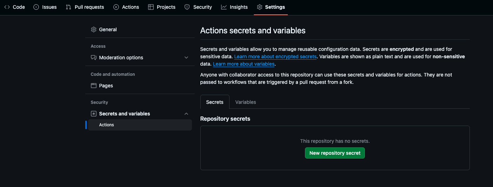

#  Vigilnz GitHub Action

## Overview
The **Vigilnz Security Scan Action** helps developers automatically check their repositories for vulnerabilities during CI/CD.  
It supports multiple scan types:
- **SCA** → Software Composition Analysis  
- **SBOM** → Software Bill of Materials generation  
- **SAST** → Static Application Security Testing  

This action makes it easy to integrate Vigilnz scanning into your GitHub workflows.

---

## Usage

To use the Vigilnz Security Scan Action, follow these steps in order:

1. [Generate API Key from Vigilnz Security](#api-key-generation).
2. [Store the API key securely in GitHub Secrets](#store-the-api-key-securely-in-github-secrets). 
3. [Add the action to your GitHub workflow](#add-the-action-to-your-github-workflow).

## API Key Generation

### To generate your Vigilnz API Key:

1. Login to the <a href="https://vigilnz.com/" target="_blank">Vigilnz</a> application.
2. Navigate to **Settings → API Keys**.
3. Click **Generate New Key** or **View API Key** (if it exists).
4. Copy the API Key and store it securely.

 

## Store the API key securely in GitHub Secrets

1. Go to your repository Settings → Secrets and variables → Actions.
2. Click New repository secret.
3. Add:
  - **Name**: VIGILNZ_API_KEY
  - **Value**: your Vigilnz API key



## Add the action to your GitHub workflow:

```yaml
name: Security Scan

on:
  push:
    branches: [ main ]
  pull_request:

jobs:
  scan:
    runs-on: ubuntu-latest
    steps:
      - uses: actions/checkout@v4

      - name: Run Vigilnz Scan
        uses: vigilnz/vigilnz-scan-action@v1
        with:
          vigilnzApiKey: ${{ secrets.VIGILNZ_API_KEY }}
          scanTypes: "sca,sbom,sast"

```

## Inputs

| Name          | Required | Description                                                |
|---------------|----------|------------------------------------------------------------|
| vigilnzApiKey | True     | Your Vigilnz API key (stored securely in GitHub Secrets).  |
| scanTypes     | True     | Comma-separated list: `sca,sast,sbom`                      |


## Example Scenarios

### Run single scan:

```yaml
with:
  vigilnzApiKey: ${{ secrets.VIGILNZ_API_KEY }}
  scanTypes: "sca"
```

### Run all scans:

```yaml
with:
  vigilnzApiKey: ${{ secrets.VIGILNZ_API_KEY }}
  scanTypes: "sca,sbom,sast"
```

