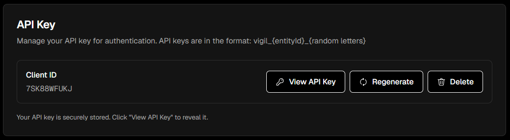
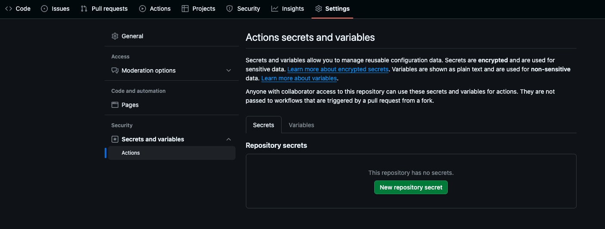

#  Vigilnz GitHub Action

## Overview
The **Vigilnz Security Scan Action** helps developers automatically check their applications and repositories for vulnerabilities during CI/CD.  
It supports multiple scan types:
- **SCA** → Software Composition Analysis  
- **SBOM** → Software Bill of Materials generation  
- **SAST** → Static Application Security Testing  
- **IAC SCAN** → Infrastructure as Code — checks configuration files (Terraform, Kubernetes, etc.) for misconfigurations.
- **SECRET SCAN** → Secret Detection — finds hardcoded credentials, API keys, and sensitive information in source code.
- **DAST** → Dynamic Application Security Testing — tests running web applications for security vulnerabilities.
- **CONTAINER SCAN** → Container Image Scanning — analyzes container images for vulnerabilities and misconfigurations.


This action makes it easy to integrate Vigilnz scanning into your GitHub workflows.

---

## Usage

To use the Vigilnz Security Scan Action, follow these steps in order:

1. [Generate API Key from Vigilnz Security](#api-key-generation).
2. [Store the API key securely in GitHub Secrets](#store-the-api-key-securely-in-github-secrets). 
3. [Add the action to your GitHub workflow](#add-the-action-to-your-github-workflow).

## API Key Generation

### To generate your Vigilnz API Key:

1. Login to the <a href="https://vigilnz.com/" target="_blank">Vigilnz</a> application.
2. Navigate to **Settings → API Keys**.
3. Click **Generate New Key** or **View API Key** (if it exists).
4. Copy the API Key and store it securely.

 

## Store the API key securely in GitHub Secrets

1. Go to your repository **Settings → Secrets and variables → Actions**.
2. Click **New repository secret**.
3. Add:
  - **Name**: VIGILNZ_API_KEY
  - **Value**: your Vigilnz API key



## Add the action to your GitHub workflow:

```yaml
name: Security Scan

on:
  push:
    branches: [ main ]
  pull_request:

jobs:
  scan:
    runs-on: ubuntu-latest
    steps:
      - uses: actions/checkout@v4

      - name: Run Vigilnz Scan
        uses: vigilnz/vigilnz-scan-action@v1
        with:
          vigilnzApiKey: ${{ secrets.VIGILNZ_API_KEY }}
          scanTypes: "SCA,SBOM,SAST,SECRET SCAN,IAC SCAN"
          projectName: "my-project"
          environment: "production"

```

## Inputs

### Required Inputs

| Name          | Required | Description                                                |
|---------------|----------|------------------------------------------------------------|
| vigilnzApiKey | True     | Your Vigilnz API key (stored securely in GitHub Secrets).  |
| scanTypes     | True     | Comma-separated list: `SCA,SBOM,SAST,SECRET SCAN,IAC SCAN,DAST,CONTAINER SCAN` |

### Optional Inputs

| Name                | Required | Description                                                                    |
|---------------------|----------|--------------------------------------------------------------------------------|
| projectName          | False    | Project name for the scan                                                      |
| environment         | False    | Environment for the scan (`dev`, `development`, `demo`, `prod`, `production`)  |

### Wait & Gating Inputs

By default the action **queues** the scans and finishes immediately — it does not wait for
results. Set `waitForCompletion: true` to block the job until every scan finishes, read the
findings back, and optionally fail the build on severity.

| Name                | Required | Default | Description                                                                    |
|---------------------|----------|---------|--------------------------------------------------------------------------------|
| waitForCompletion   | False    | `false` | Block the job until every queued scan reaches a terminal state                 |
| timeoutMinutes      | False    | `30`    | Maximum minutes to wait (clamped to 1–360)                                     |
| pollIntervalSeconds | False    | `15`    | Seconds between status polls (clamped to 5–300)                                |
| failOnSeverity      | False    | `none`  | Fail when findings exist at or above this severity: `critical`, `high`, `medium`, `low`, `none` |
| failOnScanError     | False    | `true`  | Fail when a scan errors or times out (only applies when waiting)               |

### Outputs

Outputs are always set. Severity counts are `0` unless `waitForCompletion: true`.

| Name           | Description                                                             |
|----------------|-------------------------------------------------------------------------|
| scanTargetIds  | Comma-separated scan target IDs created by this run                     |
| scanStatus     | `pending` (queue-only), `complete`, `error` or `timed_out`              |
| repoUrl        | Repository URL that was scanned                                          |
| criticalCount  | Total critical findings across all scans                                 |
| highCount      | Total high findings across all scans                                     |
| mediumCount    | Total medium findings across all scans                                   |
| lowCount       | Total low findings across all scans                                      |
| totalFindings  | Total findings across all scans                                          |
| resultsJson    | JSON array of per-scan outcomes with status and severity summary         |

### DAST Scan Inputs

| Name          | Required | Description                                    | Required When            |
|---------------|----------|------------------------------------------------|--------------------------|
| dastScanType  | False    | DAST scan type (e.g., `spider`, `active`)      | When `DAST` in scanTypes |
| dastTargetUrl | False    | Target URL for DAST scan                       | When `DAST` in scanTypes |

### Container Scan Inputs

| Name                  | Required | Description                                                                      | Required When                    |
|-----------------------|----------|----------------------------------------------------------------------------------|----------------------------------|
| containerImage        | False    | Container image name (e.g., `nginx:latest`)                                      | When `CONTAINER SCAN` in scanTypes |
| containerProvider     | False    | Registry provider: `dockerhub`, `aws-ecr`, `github`, `gitlab`, `google`, `azure`, `quay` | When `CONTAINER SCAN` in scanTypes |
| containerRegistryType | False    | Registry type: `public`, `private`, `ecr-public`, `ecr-private`, `gcr`, `artifact`, `mcr` | When required by provider |
| containerRegistryUrl  | False    | Registry URL (for private registries)                                           | When using private registries    |
| containerAuthType     | False    | Authentication type: `none`, `token`, `username-password`                       | When registry requires auth      |
| containerToken        | False    | Access token for container registry                                              | When `containerAuthType` is `token` |
| containerUsername     | False    | Username for container registry                                                  | When `containerAuthType` is `username-password` |
| containerPassword     | False    | Password for container registry (store in secrets!)                               | When `containerAuthType` is `username-password` |


## Example Scenarios

### Block the PR until scans finish, and fail on high/critical:

```yaml
- name: Vigilnz Security Scan
  id: vigilnz
  uses: vigilnz/vigilnz-scan-action@v1
  with:
    vigilnzApiKey: ${{ secrets.VIGILNZ_API_KEY }}
    scanTypes: "SCA,SAST,SECRET SCAN"
    projectName: "my-application"
    environment: "production"
    waitForCompletion: true
    timeoutMinutes: 45
    failOnSeverity: high

- name: Report
  if: always()
  run: |
    echo "Critical: ${{ steps.vigilnz.outputs.criticalCount }}"
    echo "High:     ${{ steps.vigilnz.outputs.highCount }}"
    echo "Total:    ${{ steps.vigilnz.outputs.totalFindings }}"
```

### Wait for results but never fail the build (report-only):

```yaml
with:
  vigilnzApiKey: ${{ secrets.VIGILNZ_API_KEY }}
  scanTypes: "SCA,SAST"
  waitForCompletion: true
  failOnSeverity: none
  failOnScanError: false
```

### Run single scan:

```yaml
with:
  vigilnzApiKey: ${{ secrets.VIGILNZ_API_KEY }}
  scanTypes: "SCA"
```

### Run all code-based scans:

```yaml
with:
  vigilnzApiKey: ${{ secrets.VIGILNZ_API_KEY }}
  scanTypes: "SCA,SBOM,SAST,SECRET SCAN,IAC SCAN"
  projectName: "my-application"
  environment: "production"
```

### Run DAST scan:

```yaml
with:
  vigilnzApiKey: ${{ secrets.VIGILNZ_API_KEY }}
  scanTypes: "DAST"
  dastScanType: "active"
  dastTargetUrl: "https://example.com"
  projectName: "web-application"
```

### Run Container scan (Docker Hub public image):

```yaml
with:
  vigilnzApiKey: ${{ secrets.VIGILNZ_API_KEY }}
  scanTypes: "CONTAINER SCAN"
  containerImage: "nginx:latest"
  containerProvider: "dockerhub"
  containerAuthType: "none"
```

### Run Container scan (Docker Hub private image):

```yaml
with:
  vigilnzApiKey: ${{ secrets.VIGILNZ_API_KEY }}
  scanTypes: "CONTAINER SCAN"
  containerImage: "myorg/myapp:1.0.0"
  containerProvider: "dockerhub"
  containerAuthType: "username-password"
  containerUsername: ${{ secrets.DOCKERHUB_USERNAME }}
  containerPassword: ${{ secrets.DOCKERHUB_PASSWORD }}
```

### Run Container scan (AWS ECR private):

```yaml
with:
  vigilnzApiKey: ${{ secrets.VIGILNZ_API_KEY }}
  scanTypes: "CONTAINER SCAN"
  containerImage: "myapp:latest"
  containerProvider: "aws-ecr"
  containerRegistryType: "ecr-private"
  containerRegistryUrl: "123456789012.dkr.ecr.us-east-1.amazonaws.com"
  containerAuthType: "token"
  containerToken: ${{ secrets.AWS_ECR_TOKEN }}
```

### Run Container scan (GitHub Container Registry):

```yaml
with:
  vigilnzApiKey: ${{ secrets.VIGILNZ_API_KEY }}
  scanTypes: "CONTAINER SCAN"
  containerImage: "ghcr.io/myorg/myapp:latest"
  containerProvider: "github"
  containerAuthType: "token"
  containerToken: ${{ secrets.GITHUB_TOKEN }}
```

### Run Container scan (Google Container Registry):

```yaml
with:
  vigilnzApiKey: ${{ secrets.VIGILNZ_API_KEY }}
  scanTypes: "CONTAINER SCAN"
  containerImage: "gcr.io/myproject/myapp:latest"
  containerProvider: "google"
  containerRegistryType: "gcr"
  containerAuthType: "token"
  containerToken: ${{ secrets.GCP_TOKEN }}
```

### Run Container scan (Azure Container Registry):

```yaml
with:
  vigilnzApiKey: ${{ secrets.VIGILNZ_API_KEY }}
  scanTypes: "CONTAINER SCAN"
  containerImage: "myapp:latest"
  containerProvider: "azure"
  containerRegistryType: "acr-private"
  containerRegistryUrl: "myregistry.azurecr.io"
  containerAuthType: "token"
  containerToken: ${{ secrets.AZURE_ACR_TOKEN }}
```

### Run multiple scan types together:

```yaml
with:
  vigilnzApiKey: ${{ secrets.VIGILNZ_API_KEY }}
  scanTypes: "SCA,SAST,DAST,CONTAINER SCAN"
  projectName: "full-stack-app"
  environment: "production"
  # DAST configuration
  dastScanType: "active"
  dastTargetUrl: "https://myapp.example.com"
  # Container configuration
  containerImage: "myapp:latest"
  containerProvider: "dockerhub"
  containerAuthType: "none"
```
